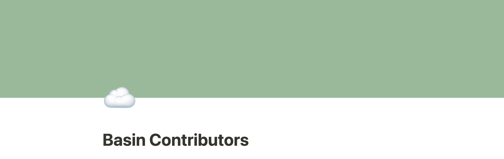

# Basin Node Development

In order to have VSCode correctly recognize Go dependencies, you might have to open the workspace with ./src as the root (or whatever folder has main.go).

## Getting started

Clone the `basin-node` repo:
```
git@github.com:sestinj/basin-node.git
```

Enter the `src` directory:
```
cd src
```

Start the application to find out what you can do:
```
go run main.go --help
```

## Command Line Interface (CLI)

### Background

[Cobra](https://github.com/spf13/cobra) is used to build the CLI for the Basin Node app

[Cobra-CLI generator](https://github.com/spf13/cobra-cli/blob/main/README.md) is used to bootstrap application scaffolding for rapid development

[Viper](https://github.com/spf13/viper) is used as a registry for all future application configuration needs as a 12 factor app

[OpenAPI Generator](https://openapi-generator.tech/) is used to automatically generate server stubs and an API client for the node's HTTP interface.

### Adding a new command

Use the Cobra-CLI generator to add a new command:
```
cobra-cli add [COMMAND_NAME]
```
